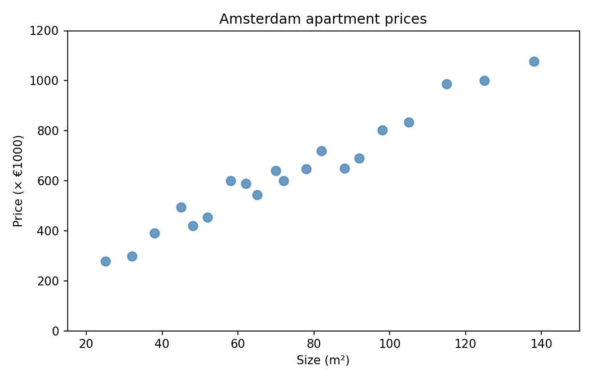
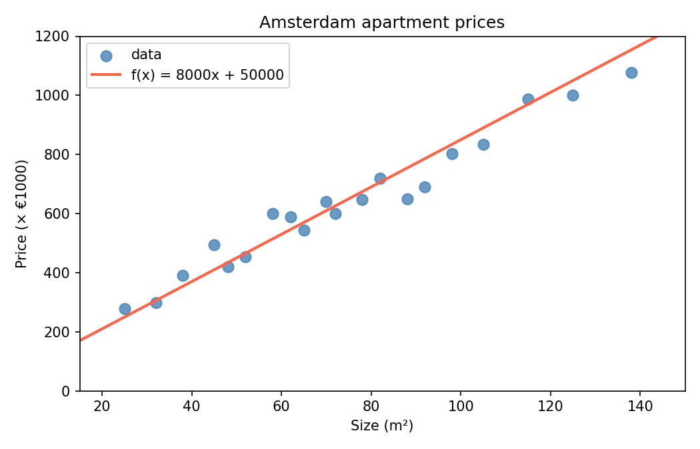

# Apply Affine

Suppose we have data on Amsterdam apartments: the size of each apartment (in m²) and its sale price (in euros). When we plot this data, we see something like this:

{: style="max-width:50%;"}

There is a clear trend: larger apartments cost more. A natural way to model this is with a straight line. If we can find the right line, we can use it to **predict** the price of any apartment given its size.

{: style="max-width:50%;"}

Finding the line that best fits the data is called **linear regression**. How we actually find it is the topic of the coming weeks. For now, let's assume we already have it.

## Step 1: predict a single value

A straight line is described by an **affine function**:

$$
f(x) = w \cdot x + b
$$

where $$w$$ is the **weight** (the slope of the line) and $$b$$ is the **bias** (the intercept). Given one input $$x$$, it produces one predicted output $$\hat{y}$$.

For the Amsterdam data, suppose we found that $$w = 8000$$ and $$b = 50000$$. Then a 60 m² apartment is predicted to cost:

$$
f(60) = 8000 \cdot 60 + 50000 = 530000
$$

## Assignment — Part 1

Create a file called `apply_affine.py` and define a function `predict(x, w, b)` that computes the affine function for a single input value.

### Example Usage

    print(predict(60.0, 8000.0, 50000.0))
    print(predict(90.0, 8000.0, 50000.0))

### Expected Output

    530000.0
    770000.0

## Step 2: predict many values at once

In practice we want to predict prices for many apartments at the same time. We can collect all the sizes in a vector and apply the affine function to every element in one function.

We can express this in vector notation, which is exactly the same as before, but $$\mathbf{x}$$ is a vector now.:

$$
f(x) = w \cdot \mathbf{x} + b
$$

When expressed using summation, this becomes:

$$
\text{apply\_affine}(\mathbf{x}, w, b)_i = w \cdot x_i + b
$$

The result is a new vector of predicted prices $$\hat{\mathbf{y}}$$.

## Assignment — Part 2

Define a second function `apply_affine_vec(xs, w, b)` that takes a list of input values and returns a new list of predictions. 

### Example Usage

    sizes = [30.0, 45.0, 60.0, 75.0, 90.0, 120.0]
    print(apply_affine(sizes, 8000.0, 50000.0))

### Expected Output

    [290000.0, 410000.0, 530000.0, 650000.0, 770000.0, 1010000.0]

A 30 m² studio is predicted to cost €290,000. A 120 m² apartment comes out at just over a million. Whether these numbers are any good depends entirely on how well $$w$$ and $$b$$ were chosen.

Choosing the best values for $$w$$ and $$b$$ is exactly what we will learn to do later. 

## Run

Run your program and verify that it indeed displays the expected text:

    python apply_affine.py

## Checkpy

You can use checkpy to verify that it meets our requirements:

    checkpy apply_affine
