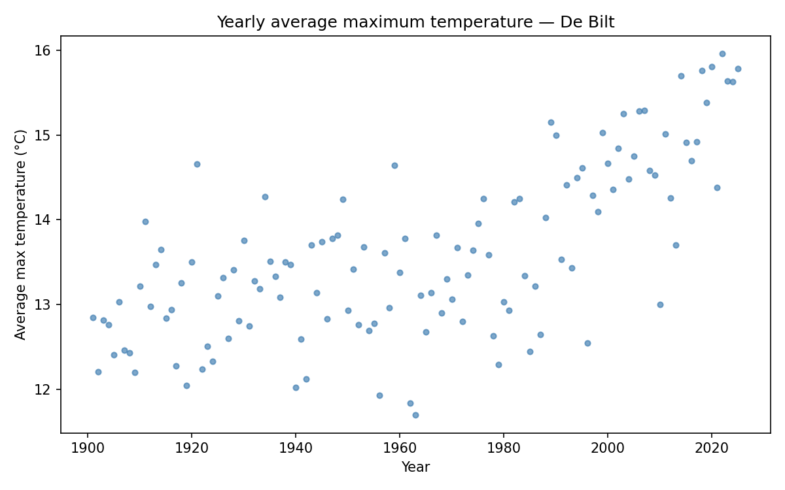

# Gradient Descent

We have data on yearly average maximum temperatures measured at De Bilt, from 1901 to 2025:

{: style="max-width:70%;"}

We want to find the straight line that best fits this data — the line that minimises the total prediction error. Finding that line is called **linear regression**, and we will solve it using **gradient descent**.

## The setup

We model the temperature in year $$x$$ as:

$$\hat{y} = w \cdot x + b$$

where $$w$$ (weight) is the slope and $$b$$ (bias) is the intercept. Both are scalars.

Because the years are large numbers (1901–2025), we first **centre** them around their mean $$\bar{x}$$:

$$x_c = x - \bar{x}$$

We fit on the centred years $$\mathbf{x}_c$$. The slope $$w$$ stays the same; $$b$$ becomes the predicted temperature at the mean year.

## The loss

Given predictions $$\hat{\mathbf{y}} = \text{apply\_affine}(\mathbf{x}_c, w, b)$$ and targets $$\mathbf{y}$$, the residuals are:

$$r_i = \hat{y}_i - y_i \qquad \mathbf{r} = \hat{\mathbf{y}} - \mathbf{y}$$

The **mean squared error** measures how well the line fits:

$$L(w, b) = \frac{1}{n} \Sigma_{i=0}^{n-1} r_i^2 = \frac{1}{n} \langle \mathbf{r},\ \mathbf{r} \rangle$$

## The gradients

To minimise $$L$$, we need its partial derivatives with respect to $$w$$ and $$b$$. Both are **scalars**:

$$\frac{\partial L}{\partial w} = \frac{2}{n} \Sigma_{i=0}^{n-1} r_i \cdot x_{c,i} = \frac{2}{n}\ \langle \mathbf{r},\ \mathbf{x}_c \rangle$$

$$\frac{\partial L}{\partial b} = \frac{2}{n} \Sigma_{i=0}^{n-1} r_i = \frac{2}{n}\ \langle \mathbf{r},\ \mathbf{1} \rangle$$

where $$\mathbf{1}$$ is a vector of ones of length $$n$$.

## The update step

At each iteration, we nudge $$w$$ and $$b$$ in the direction that reduces the loss:

$$w \leftarrow w - \alpha \cdot \frac{\partial L}{\partial w}$$

$$b \leftarrow b - \alpha \cdot \frac{\partial L}{\partial b}$$

where $$\alpha$$ is the **learning rate** — a small positive scalar that controls the step size.

## Assignment

Create a file called `gradient_descent.py`. Read `yearly_avg_temp.csv`, centre the years, and copy in your `apply_affine`, `vector_diff`, `inner_product`, and `mse` functions from week 5.

Then implement the following function:

    def fit(w_start, b_start, n_iterations, learning_rate):
        ...
        return w, b, mse_list

The function runs gradient descent for `n_iterations` steps starting from `w_start` and `b_start`. It returns the final $$w$$, the final $$b$$, and a list of the MSE after every iteration.

### Part 1: first run

Call the function with:

    w, b, mse_list = fit(0, 0, 5000, 1e-5)

Print the result:

    print(f"w = {w:.6f}")
    print(f"b = {b:.6f}")
    print(f"MSE = {mse_list[-1]:.4f}")

### Expected output

    w = 0.019006
    b = 1.294239
    MSE = 151.9876

This is only a partial result — 5000 iterations at this learning rate is not enough to fully converge. You will fix that in the next assignment.

### Part 2: plot

Plot the fitted line on top of the scatter data, and plot the `mse_list` as a second figure showing how the loss decreased over the iterations.

## Run

    python gradient_descent.py

## Checkpy

    checkpy gradient_descent